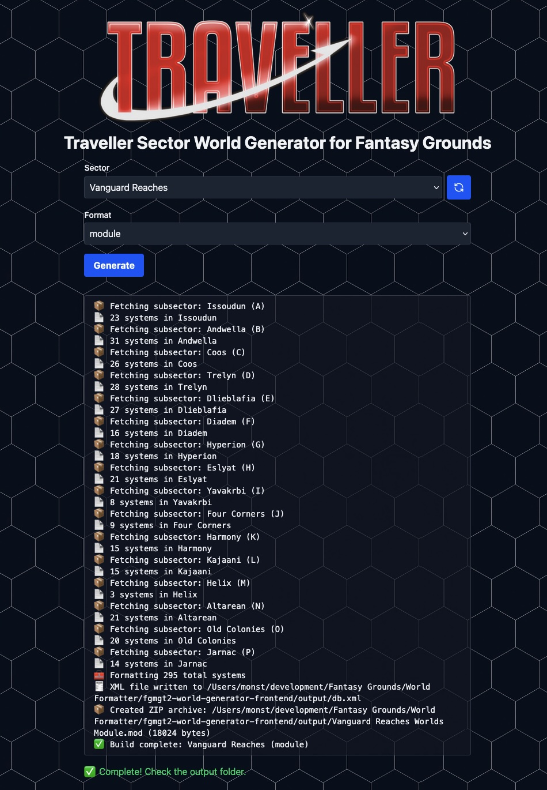

---

# 🌌 Traveller Sector to Fantasy Grounds Module Generator

A web-based tool to fetch data from [TravellerMap](https://travellermap.com/), format it, and output a `.mod` file compatible with Fantasy Grounds. Built using Astro, Vite, and Node.js tooling.

---

## 🚀 Features

- Dynamically fetches sector names from the [TravellerMap API](https://travellermap.com/api/universe)
- Caches sector list in localStorage for 30 days (for fast access)
- Manual refresh (♻️) button to re-fetch sector list
- Supports multiple output formats:
  - **Module** (`.mod` ZIP file for Fantasy Grounds)
  - **System** (plain `.txt` file)
- CLI-style progress messages in the browser
- Clean, modern frontend powered by Astro + Vite

---



---

## 📦 Installation

### Prerequisites

- Node.js (v18 or newer recommended)
- `pnpm`, `npm`, or `yarn`
- Internet connection (for accessing TravellerMap data)

### 1. Clone the repository

```bash
git clone https://github.com/your-username/fg-traveller-sector-generator.git
cd fg-traveller-sector-generator
```

### 2. Install dependencies

```bash
pnpm install
# or
npm install
# or
yarn install
```

### 3. Start the development server

```bash
pnpm dev
# or
npm run dev
```

The app will be available at [http://localhost:4321](http://localhost:4321)

---

## 🧭 Usage

1. Open the web interface in your browser.
2. Select a sector name from the dropdown (fetched from the TravellerMap API).
3. If needed, click the ♻️ button next to the dropdown to re-fetch the latest list.
4. Choose your desired output format:
   - `module` for `.mod` file
   - `system` for plain `.txt` export
5. Click **Generate**.
6. The tool will:
   - Fetch all 16 subsectors
   - Parse and format the systems
   - Output your file in the `output/` folder

Progress messages appear in real-time:

```
📦 Fetching subsector: Regina (A)
📄 43 systems in Regina
🧰 Formatting 439 total systems
✅ Build complete: Spinward Marches (module)
```

---

## 📁 Output

All files are saved to the local `output/` folder:

- `db.xml` — raw XML used inside `.mod` files
- `definition.xml` — module metadata
- `Spinward Marches Worlds Module.mod` — zipped `.mod` archive
- `Spinward Marches systems.txt` — plain system list (only for `system` format)

---

## 🛠️ Development Notes

- Uses `fetch` to pull data from: `https://travellermap.com/data/{sector}/{subsector}/sec`
- Sector list pulled from: [`/api/universe?milieu=M1105&tag=Official&requireData=1`](https://travellermap.com/api/universe?milieu=M1105&tag=Official&requireData=1)
- Sector names are cached in `localStorage` for 30 days
- You can force-refresh sector list by clicking the ♻️ icon
- Uses `archiver` to build `.mod` files

To install `archiver` if needed:

```bash
pnpm add archiver
```

---

## 🧙 Fantasy Grounds Instructions

1. Copy the `.mod` file to your Fantasy Grounds `modules/` directory.
2. Launch Fantasy Grounds and open your campaign.
3. Enable the module via the Library → Modules window.
4. Navigate to the Worlds category to browse the data.

---

## 📜 License

MIT License © Colin 'MadBeardMan' Richardson

---

## 🌍 Acknowledgements

- [TravellerMap API](https://travellermap.com/api)
- [Mongoose Publishing — _Traveller 2e_](https://www.mongoosepublishing.com/collections/traveller-rpgs))
- [SmiteWorks — _Fantasy Grounds_](https://www.fantasygrounds.com/store/?sys=30&sort=1#TopSellers)

---

## 📘 Trademark Notice

Traveller and the Traveller logo are trademarks of Mongoose Publishing.
This project is a fan-made tool and is not affiliated with or endorsed by Mongoose Publishing.
